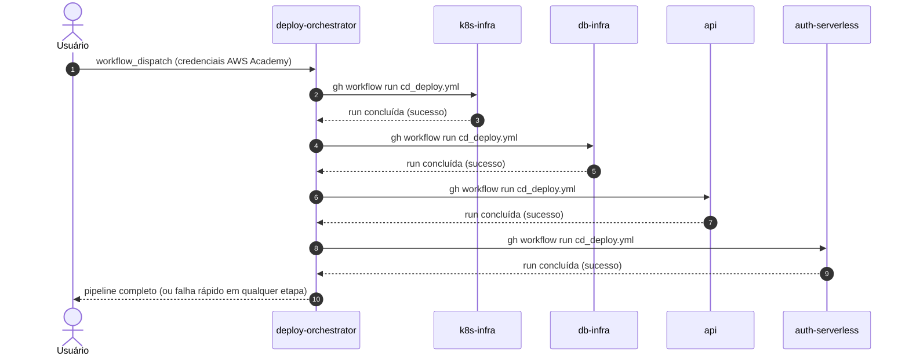

# deploy-orchestrator

Orquestração de deploy multi-repositório do projeto **Oficina Mecânica** — Fase 3 do Tech Challenge FIAP.

Este é um **5º repositório auxiliar**, fora da contagem dos 4 repositórios exigidos pelo desafio (Lambda, Infra K8s, Infra DB, App principal). Ele não contém nenhuma infraestrutura própria — apenas dispara e aguarda, em sequência, o workflow `CD Deploy`/`CD Destroy` de cada um dos 4 repositórios reais, recebendo as credenciais efêmeras da sessão AWS Academy **uma única vez**.

| Repositório | Responsabilidade |
| :--- | :--- |
| [`k8s-infra`](https://github.com/FIAP-15SOAT-GabrielHelton/k8s-infra) | VPC + EKS + node group |
| [`db-infra`](https://github.com/FIAP-15SOAT-GabrielHelton/db-infra) | RDS PostgreSQL |
| [`api`](https://github.com/FIAP-15SOAT-GabrielHelton/api) | Aplicação Rails + ECR + deploy no cluster |
| [`auth-serverless`](https://github.com/FIAP-15SOAT-GabrielHelton/auth-serverless) | API Gateway + Lambdas de autenticação/RBAC |
| `deploy-orchestrator` (este repo) | Orquestra o deploy/destroy dos 4 repos acima |

## Tecnologias utilizadas

| Categoria | Tecnologia |
| :--- | :--- |
| CI/CD | GitHub Actions (`workflow_dispatch`) |
| Orquestração | GitHub CLI (`gh workflow run`, `gh run watch`) via script Bash |
| Autenticação cross-repo | Personal Access Token (`ORCHESTRATOR_PAT`) |

## Arquitetura



## Como funciona

`gh workflow run` não é chamável entre repositórios com o `GITHUB_TOKEN` padrão do Actions — por isso este repositório usa um **Personal Access Token** (`ORCHESTRATOR_PAT`, secret) com escopo `repo` + `workflow` nos 4 repositórios de destino.

O script [`.github/scripts/run_and_wait.sh`](.github/scripts/run_and_wait.sh) dispara o workflow (`gh workflow run --repo ...`), localiza a run recém-criada e usa `gh run watch --exit-status` para aguardar a conclusão — se qualquer etapa falhar, a cadeia é interrompida.

## Contrato de dados entre os repositórios (AWS SSM Parameter Store)

| Parâmetro | Publicado por | Consumido por |
| :--- | :--- | :--- |
| `/oficina-mecanica/vpc_id` | `k8s-infra` | `db-infra` |
| `/oficina-mecanica/subnet_ids` | `k8s-infra` | `db-infra` |
| `/oficina-mecanica/eks_cluster_name` | `k8s-infra` | `api` |
| `/oficina-mecanica/rds_address`, `/rds_endpoint` | `db-infra` | `api` |
| `/oficina-mecanica/rails_api_base_url` | `api` | `auth-serverless` |

## Execução local

Não há aplicação para "rodar" — o script pode ser validado localmente sem disparar nada de verdade:

```bash
bash -n .github/scripts/run_and_wait.sh   # checagem de sintaxe
```

Para testar a orquestração de fato, é preciso disparar o workflow `Deploy All`/`Destroy All` (aba **Actions**) com credenciais reais da sessão AWS Academy — não há como simular isso localmente, já que ele chama a API do GitHub para outros repositórios.

## Deploy / Destroy completos

- **`Deploy All`** (`workflow_dispatch`): `k8s-infra → db-infra → api → auth-serverless`.
- **`Destroy All`** (`workflow_dispatch`): ordem inversa — `auth-serverless → api → db-infra → k8s-infra`.

Ambos recebem `aws_access_key_id`, `aws_secret_access_key` e `aws_session_token` da sessão AWS Academy (expiram em ~4h) e os repassam para cada repositório disparado.

## Configuração necessária

Secret do repositório: `ORCHESTRATOR_PAT` — Personal Access Token (classic, escopos `repo` + `workflow`, ou fine-grained com `Actions: write` + `Contents: read`) com acesso aos repositórios `k8s-infra`, `db-infra`, `api` e `auth-serverless`.

Cada um dos 4 repositórios continua com seu próprio `workflow_dispatch` independente — este orquestrador é uma conveniência, não uma dependência obrigatória.

## Documentação da API

Este repositório não expõe nenhuma API HTTP — é só orquestração de CI/CD. A documentação da API do projeto (Swagger/OpenAPI) vive no repositório [`api`](https://github.com/FIAP-15SOAT-GabrielHelton/api#documenta%C3%A7%C3%A3o-da-api).
